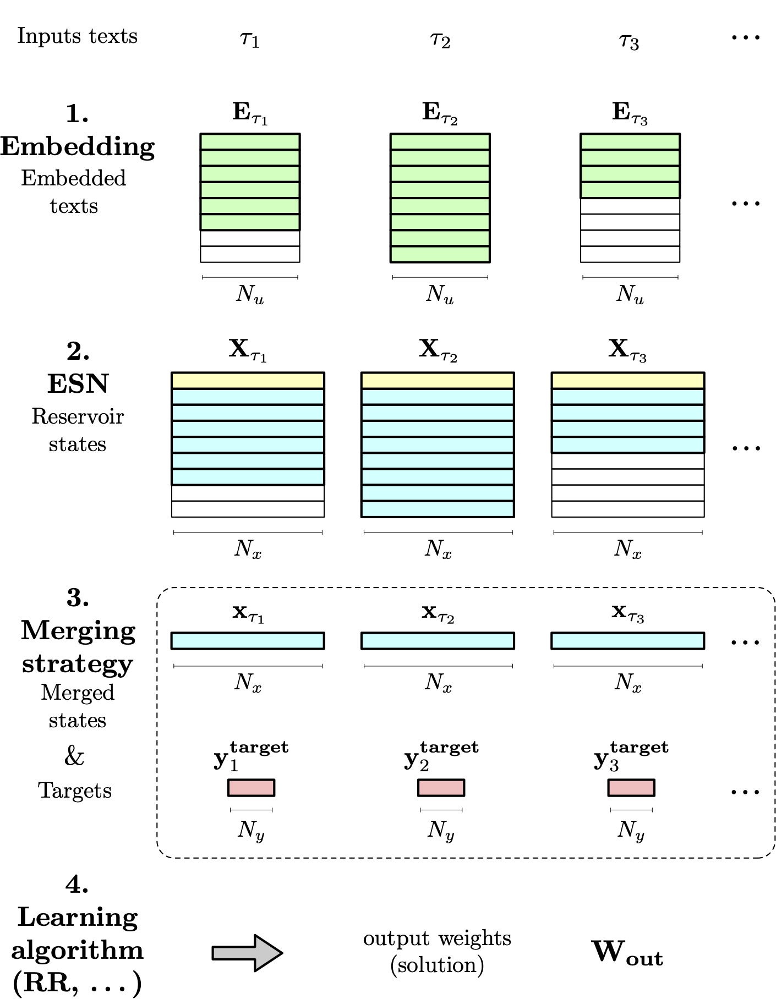

.. _esn_description:

Echo State Networks for Text Classification
===========================================

Model
-----

An *echo state network (ESN)* is a recurrent neural network composed of
:math:`N_u` input units, :math:`N_x` hidden units composing the
so-called *reservoir*, and :math:`N_y` output units. The input units
project onto the reservoir :math:`(\mathbf{W_{in}})`, which is itself
recurrently connected :math:`(\mathbf{W_{res}})`, and projects onto the
output units :math:`(\mathbf{W_{out}})`.

.. image:: ./figures/esn.png
    :width: 30px
    :scale: 50
    :alt: An echo state network (ESN).
    :align: center

Here, we consider *Leaky Integrator ESNs*. The inputs, reservoir state
and outputs of the network at time :math:`t > 0` are denoted by
:math:`\mathbf{u}(t) \in \mathbb{R}^{N_u}`,
:math:`\mathbf{x}(t) \in \mathbb{R}^{N_x}` and
:math:`\mathbf{y}(t) \in \mathbb{R}^{N_y}`, respectively. The state
:math:`\mathbf{x}(0)` is the *initial state*. The dynamics of the
network is then given by the following equations:

.. math::

   \mathbf{\tilde{x}}(t+1) & = f_{res} \left( \mathbf{W_{in}} [\mathbf{1}, \mathbf{u}(t+1)] + \mathbf{W_{res}} \mathbf{x}(t) \right) \\
   \mathbf{x}(t+1)         & = (1-\alpha) \mathbf{x}(t) + \alpha \mathbf{\tilde{x}}(t+1) \\
   \mathbf{y}(t+1)         & = f_{out} \left( \mathbf{W_{out}} [\mathbf{1}, \mathbf{x}(t+1)] \right)

where :math:`[\mathbf{a}, \mathbf{b}]` denotes the concatenation of
:math:`\mathbf{a}` and :math:`\mathbf{b}`, :math:`\mathbf{x}(0)` is the
*initial state*, :math:`f_{res}` and :math:`f_{out}` are the *activation
functions* of the reservoir and output cells (applied component-wise),
and :math:`\alpha` is the *leaking rate* (:math:`0 \leq \alpha \leq 1`).

The leaking rate controls the update speed of the reservoir dynamics.
The input weights :math:`\mathbf{W_{in}}` are initialized randomly from
a uniform distribution :math:`\mathcal{U}(-a,a)`, where :math:`a` is the
*input scaling*, and kept fixed during the whole training process. The
input scaling determines the extent of nonlinearity of the reservoir
response. The reservoir weights :math:`\mathbf{W_{res}}` are drawn from
the uniform or Gaussian distribution, then randomly set to :math:`0`
with a given *sparsity rate*, and finally rescaled in order to have a
specific *spectral radius* :math:`\rho` (usually, we choose
:math:`\rho < 1`). The reservoir weights :math:`\mathbf{W_{res}}` are
also kept fixed during training. Only the output
:math:`\mathbf{W_{out}}` are trainable.

Training
--------

In an ESN, only the output weights :math:`\mathbf{W_{out}}` are trained.
The training process can be described as follows. Consider some training
set :math:`\mathcal{S}` composed of temporal inputs and associated
targets, i.e.,

.. math::

   \mathcal{S} = \Big\{ \big( \mathbf{u}(t), \mathbf{y^{target}}(t) \big) : t = 1, \dots, T \Big\}.

Let :math:`\mathbf{x}(1), \dots ,\mathbf{x}(T)` and
:math:`\mathbf{y}(1), \dots ,\mathbf{y}(T)` be the successive reservoir
states and predictions obtained when running the ENS on inputs
:math:`\mathbf{u}(1), \dots ,\mathbf{u}(T)`, respectively. Then, the
output weights :math:`\mathbf{W_{out}}` are computed by minimizing some
cost function :math:`\mathcal{L}` of the predictions and targets via any
desired learning algorithm – e.g., a simple Ridge regression. Usually,
some initial transient of the ESN dynamics is used as a warm-up of the
reservoir, and :math:`\mathbf{W_{out}}` is computed on the basis of the
remaining suffix of collected states, predictions and and targets.

Classical temporal tasks involve time series where each point is
associated with a corresponding target. By contrast, in the present
case, the task comprises *multiple* time series as inputs – the
successive embedded texts – each of which being associated with only
*one* output target – its corresponding class. We propose a customized
training process targeted at this *many-to-one* paradigm.

Our training paradigm consist of the four following steps:
    #. Embed the successive texts (FastTest, GloVe, etc.);
    #. Pass the embedded texts into the ESN;
    #. Merge the reservoir states associated to the successive texts (last, mean, etc.);
    #. Learn the association between the merged states and associated targets.

The training process is illustrated in the figure below.

